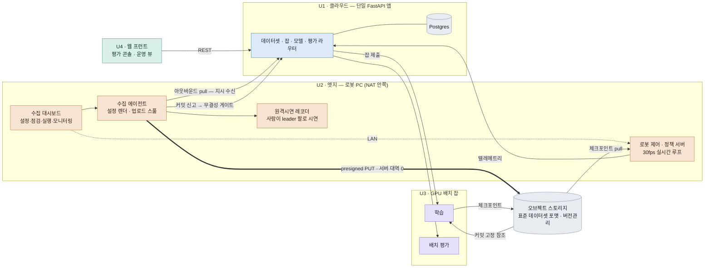
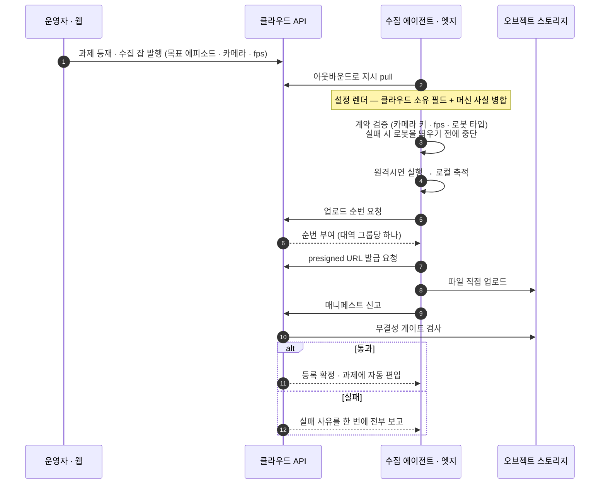
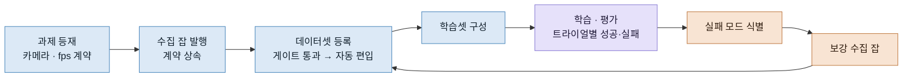
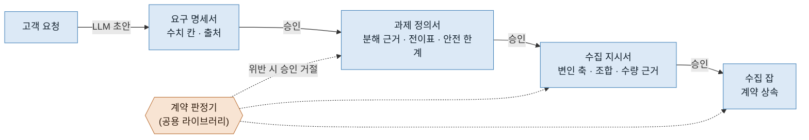

# 아키텍처

## 배포 단위 — 디렉터리 16개, 배포물 4개

역할 디렉터리를 그대로 배포 단위로 삼으면 배포물이 16개가 됩니다. 개발자 소수·로봇 PC 소수인
단계에서는 운영 비용만 늘어납니다. **기본값을 "단일 클라우드 앱"으로 두고, 거기서 빠져나갈
근거가 있는 것만 분리**했습니다.

| 단위 | 무엇 | 왜 따로인가 |
|---|---|---|
| **U1** 클라우드 API | 단일 FastAPI 앱 — 데이터셋 등록·게이트, 잡 명세, 모델 레지스트리, 평가 세션 | 기본값 (나머지가 예외) |
| **U2** 엣지 스택 | 수집 에이전트, 수집 대시보드, 로봇 제어, 정책 서버 | **다른 컴퓨터다.** USB 직결·하드웨어 인코딩·30fps 루프·방화벽 안쪽 |
| **U3** GPU 배치 잡 | 학습, 배치 평가, 에피소드 셋 실체화 | **서버가 아니다.** 뜨고 죽는 워크로드, GPU 노드 스케줄 |
| **U4** 웹 프런트 | 평가 콘솔 + 운영 뷰 SPA, 랜딩 | 보안 경계와 빌드 파이프라인이 다르다 |

새 기능은 기본적으로 U1의 라우터나 U4의 화면으로 들어갑니다. U2·U3로 가려면
「다른 컴퓨터」·「서버가 아님」 중 하나에 해당해야 합니다.



굵은 화살표가 대용량 경로입니다. **엣지는 스토리지 자격증명을 갖지 않고** 스코프된 presigned URL만 받습니다.

## 수집 한 건이 등록되기까지



두 가지가 이 흐름의 핵심입니다.

**계약 검증을 로봇보다 먼저 돌립니다.** 카메라 키나 fps가 잡 명세와 어긋나면 로봇을 기동하기 전에
멈춥니다. 사람이 팔을 잡고 30분 시연한 뒤에 "카메라 키가 틀렸다"고 알려주는 것은 현장에서
가장 비싼 실패입니다.

**게이트는 첫 실패에서 멈추지 않습니다.** 위반 항목을 전부 모아 한 번에 보고합니다. 현장 왕복을
줄이기 위한 선택입니다.

## 무결성 게이트

업로드가 끝났다고 데이터셋이 되지는 않습니다. 아래를 전부 통과해야 등재됩니다.

- 메타데이터가 선언한 에피소드 수 == 실제 파일에 기록된 행수 합
- 데이터셋의 카메라 키 == 잡 명세가 요구한 카메라 키
- 데이터셋 fps == 잡 명세 fps
- 업로드된 전체 파일의 체크섬 == 신고된 체크섬
- 과제 문자열 일치
- 필수 메타데이터 파일 존재 (부분 업로드 상태 등록 차단)

통과해야만 등록 에피소드 수가 갱신되므로 **부분 업로드가 유효한 데이터셋으로 보이지 않습니다.**
학습 잡은 데이터셋 이름이 아니라 **커밋 단위로 고정 참조**해서, 나중에 데이터가 추가돼도
과거 학습의 입력이 흔들리지 않습니다.

## 업로드 스풀 — 끊겨도 계속된다

```
[수집 완료] → PENDING → UPLOADING → UPLOADED → (커밋) → COMMITTED
                 ▲          │
                 └── 실패 ──┤ 지수 백오프 → QUARANTINED (사람 확인 · 자동 삭제 없음)
```

단위는 파일, 멱등 키는 `(데이터셋, 상대경로, 콘텐츠 해시)`입니다. 이어쓰기로 해시가 바뀌면
자동으로 재업로드 대상이 되고, 커밋이 수락되면 그 경로의 구 해시 행은 은퇴 처리됩니다.
격리된 항목은 **자동 삭제하지 않습니다** — 수집 데이터는 사람이 시간을 들여 만든 것이라
자동 정리의 대상으로 두지 않았습니다.

## 데이터 개선 루프



이 연결이 없으면 "무엇을 더 모아야 하는가"가 사람의 기억에 의존합니다. 평가에서 드러난 실패
모드를 그대로 다음 수집 잡의 조건으로 넘길 수 있게, 과제·데이터셋·에피소드를 두 층으로
모델링했습니다. 과제는 **데이터셋**을 묶고, 에피소드 셋은 여러 데이터셋에서 조건으로 고른
**에피소드**를 참조합니다.

## 요청에서 잡까지 — 승인 관문은 판정기가 쥔다

수집 잡은 사람이 JSON을 손으로 써서 만들지 않습니다. 고객 요청에서 출발해 문서 세 장을 거칩니다.



- **LLM은 초안만 씁니다.** 각 단계의 초안은 LLM이 만들지만 승인은 사람이 하고, 그 전에 계약
  판정기가 먼저 봅니다. 출처가 빈 칸, 실행 가능성 검사를 통과하지 못한 과제, 근거 없는 수량은
  승인 버튼 자체가 잠깁니다.
- **수치로 판정할 수 있는 것은 LLM에게 맡기지 않습니다.** 기종 제원(값마다 출처 병기)과 요구
  수치를 대조하는 실행 가능성 판정은 코드가 하고, LLM 출력의 해당 칸은 무시합니다. 못 알아본
  단위는 기본 단위로 추정하지 않고 「모른다」로 둡니다.
- **조합은 서버가 만듭니다.** 변인 축(조명·물체 위치 등)과 수준에서 필요한 표본 수 N을 계산하고,
  편수 예산에 따라 전수·Pairwise·랜덤 중 하나를 고릅니다. 잡이 끝나면 모자란 조합을 사후 보충합니다.
- **판정의 정의를 한 곳에 둡니다.** 회차 합격 조건(네 조건 + 「모른다」), 실패·복구 에피소드를
  저장할지의 정책, 서브태스크 단계 라벨, 커버리지 판정이 모두 같은 라이브러리에 있어서
  서버·엣지·운영 화면이 서로 다른 답을 내지 않습니다.
- **되돌릴 길을 둡니다.** 승인 관문은 4상태 전이(대기·승인·반려·폐기)이고, 반려에는 사유가
  필수이며 그 사유가 다음 초안의 입력으로 들어갑니다.

## 현장 사전 차단 — 찍기 전, 올리기 전

무결성 게이트는 업로드 **뒤**의 마지막 방어선입니다. 그 전에 두 번 더 막습니다.

| 시점 | 무엇을 보나 | 막히면 |
|---|---|---|
| **찍기 전** | 잡 계약 대조(카메라 키·fps·기종), 이어받기 가능 여부 | 로봇을 띄우지 않는다 |
| **올리기 전** | 엣지가 서버와 **같은 폴백 규칙**으로 게이트 항목을 미리 검사 | 스풀에서 격리, 자동 삭제하지 않는다 |
| **등록 시** | 무결성 게이트 | 사유를 전부 모아 한 번에 보고 |

막힌 사유는 서버의 **현장 차단 원장**에 신고되고, 운영 화면의 잡 상세에 「왜 멈췄는지 · 무엇을
하면 되는지」로 뜹니다. 같은 차단이 반복되면 원장에 접어서 쌓고, 신고 커서를 둬서 「지금도
막혀 있나」가 서버까지 정확히 전달되게 했습니다. **막혔다와 실패했다를 구분**하는 것이 원칙입니다 —
막힘은 사람이 풀면 이어지는 상태라 자동 재시도를 끄지 않습니다.

## 플릿 — 로봇 PC를 원격으로 관리한다

로봇 PC가 늘면 "어느 PC에 어느 버전이 도는가"를 사람이 기억할 수 없습니다.

- **머신 토큰.** 각 로봇 PC는 등록부에서 발급한 토큰으로 모든 클라우드 요청에 주체를 싣습니다.
  엣지가 어느 현장·기종인지는 요청 본문이 아니라 토큰에서 유도합니다.
- **선언 / 실제 / 드리프트.** 운영자는 PC별로 "이 버전이어야 한다"를 선언하고, 엣지는 지금 도는
  버전을 보고합니다. 운영 화면은 두 값과 그 차이를 한 칸에 보여 줍니다.
- **수집 중이면 미룬다.** 엣지 supervisor가 선언을 당겨와 적용하지만, 수집이 도는 동안에는
  적용을 미룹니다. 사람이 팔을 잡고 있는 순간 재시작하는 것이 가장 비싼 사고입니다.
- **잡 배정 겹침 방지.** 한 잡이 두 PC에, 한 PC가 두 잡에 배정되지 않도록 머신 상호배제·리스·
  회수 스위퍼를 두고, 폴링 배정은 PC의 기종으로 좁힙니다. 받지 못한 잡은 줄마다 이유를 답합니다.

## 인증과 현장 격리

- 신원은 OIDC 토큰으로 받고, 서버는 서명·클레임만 검증합니다. 인가는 **「역할 4 × 범위 2」**
  (전체 / 배정받은 것)로 서버가 소유합니다.
- 브라우저는 BFF의 httpOnly 세션 쿠키만 갖고, 클라우드 API로 가는 토큰은 BFF가 서버 측에서
  붙입니다. 검수 서비스는 외부에 노출하지 않고 BFF 뒤에 둡니다.
- 모든 조회는 **현장(site) 단위로 좁혀집니다.** "현장이 정해지지 않음"이 "전부 공개"로 해석되지
  않도록, 현장이 비면 하류 서비스를 부르지 않는 규칙을 문서와 테스트로 고정했습니다.

## 나중에 쪼갤 조건

미리 쪼개지 않는 대신, 쪼갤 시점을 관측 가능한 조건으로 적어 뒀습니다.

- 게이트 검증이 CPU를 먹어 조회 API 응답을 밀어낼 때 → 검증 워커 분리
- 텔레메트리가 커져 API를 밀어낼 때 → 인제스트 경로 분리
- 등록이 죽어도 조회는 살아야 하는 요구가 생길 때 → 읽기 경로 분리
- 배포 주기가 서로를 막을 때 → 해당 라우터를 서비스로

"언젠가 커질 테니 지금 나누자"를 막고, 실제로 관측되면 그 부분만 떼어내기 위한 장치입니다.
